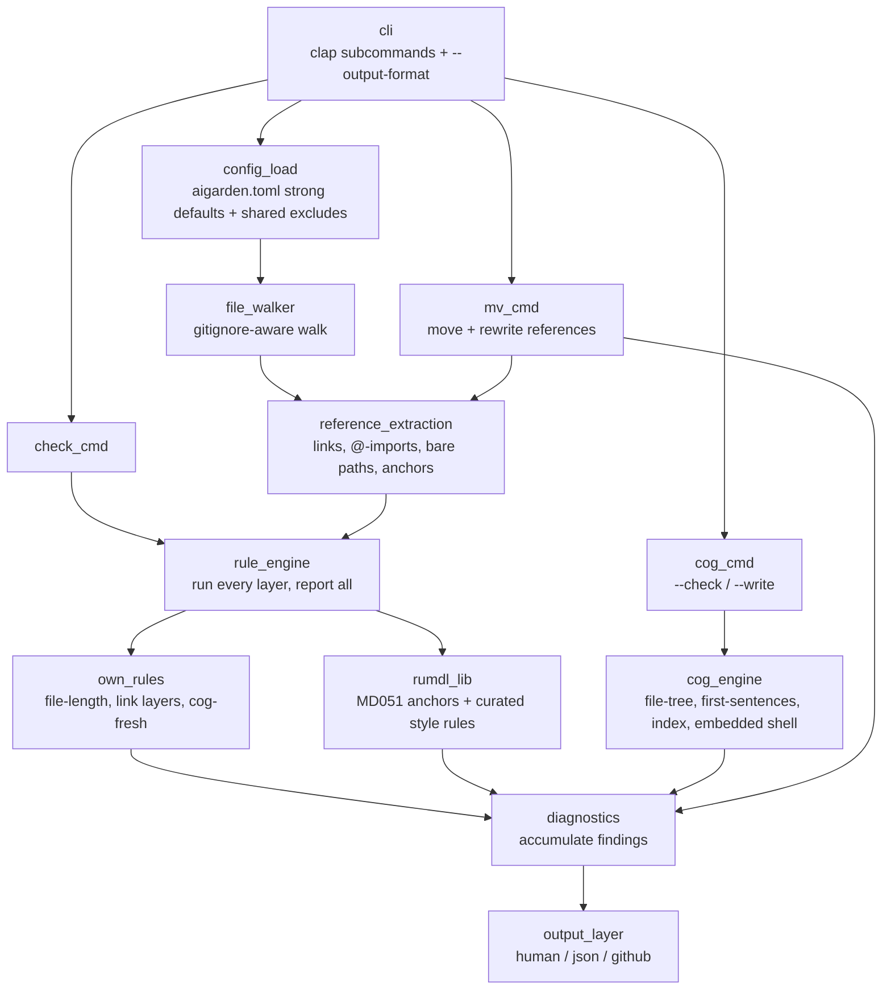

# aigarden design

`aigarden` is a Rust CLI that lints and maintains repositories for collaboration between AI agents and human contributors. It automates link integrity, context-size budgets, and generated-content freshness in one pass.

## Architecture

A single reference-extraction core powers both reference checking and move rewriting, preventing grammar drift between verification and manipulation.



Key design fixes over legacy hand-grown scripts:
- **Comprehensive reporting:** Runs all rules in a single pass rather than exiting at the first failing layer.
- **Unified reference parsing:** `check` and `mv` share a single parser with native byte spans.
- **Centralized exclusions:** Walker-level path filters apply across all rules and operations.
- **Accurate line counting:** `file-length` tracks true lines without undercounting files lacking trailing newlines.
- **Isolated cog failures:** A broken cog generator emits a localized finding without crashing the scan run.

## Rule Catalog

Rules use kebab-case names without numeric codes. All rules are enabled by default and toggleable via `ignore` or `[per-file-ignores]`.

### Reference Integrity
- `link-target`: Relative markdown target must exist on disk; extensionless links resolve to `.md`. Implemented directly on the shared core for byte-span tracking rather than via `rumdl_lib` MD057.
- `anchor-resolves`: Target `#fragment` (local or cross-file) must resolve to a valid heading using GitHub slug rules via `rumdl_lib` MD051.
- `import-target`: Target `@path` imports inside always-loaded files (`CLAUDE.md`, `AGENTS.md`, `SKILL.md`) must exist on disk to prevent silent runtime failures.
- `bare-path`: Backticked file paths with interior slashes and valid extensions must exist relative to the file or repository root. The walker skips git-ignored paths; paths matched by `[bare-path] external` globs (such as `~/.writer/config.toml`) are ignored globally.
- `link-case`: Markdown target paths must match filesystem casing exactly, preventing cross-platform failures on case-sensitive CI environments.
- `code-doc-ref`: Root-relative doc paths (`docs/…`, `issues/…`) referenced inside non-markdown source files must exist on disk. The walker skips git-ignored targets.

### Size Budgets
- `file-length`: Enforces file boundaries configured via `"glob" = { lines | tokens = N }`. Code paths budget line counts; guidance and prose documents budget token counts (~4 chars/token).

### Markdown Style
- `markdown-style`: Curated, auto-fixable rules from `rumdl_lib` (whitespace, fence spacing, trailing newlines). The opt-in `reflow` setting manages paragraph structures without external `.rumdl.toml` files: `"wrap"` formats lines past 80 columns; `"never-wrap"` unrolls paragraphs into single physical lines while leaving code blocks and tables untouched. Running `aigarden check --fix` mutates files on disk and re-evaluates remaining errors. Cog markers and generated cog bodies follow the rules in [Cogs and markdown style](#cogs-and-markdown-style).

### Content Freshness
- `cog-fresh`: Ensures dynamic cog blocks on disk match the current evaluation of their generators. Covers markdown files plus the non-markdown globs in `[cog-fresh] extend-include` (see [Cogs](#cogs)).

### Link Readability
- `descriptive-anchor`: Flags links whose visible text consists entirely of a stable ID (e.g., `[ADR-0026]`). Target patterns are configured via regex in `[descriptive-anchor] patterns`. The rule is inert until patterns are declared. Parenthetical mentions like `(see [ADR-0026])` or augmented titles like `[ADR-0026 — gated publication]` are permitted.

### Frozen History
- `status-header`: Enforces a `**Status:** <value>` header on docs matching `[status-header] files`. A status with a leading keyword in `live` is audited normally. A status keyword in `terminal` marks the document as historical and suppresses all rules listed in `[status-header] suppresses`.
  - Only citation rules (`link-target`, `link-case`, `bare-path`, `import-target`, `anchor-resolves`, `descriptive-anchor`) are suppressible; listing structural rules triggers configuration errors.
  - Setting `inherits-from = "plan.md"` allows peer files in the same directory lacking headers to inherit the status of the named file.
  - The rule is inert until `files` is specified.

### Introspection Commands
Rule metadata is defined directly on the `Rule` trait:
- `aigarden rules`: Prints the name, status (`report-only`, `fixable`, `config-gated`), and summary description for all rules.
- `aigarden explain <rule>`: Displays detailed documentation for a specific rule. Unknown names exit with code 2 and print available options.

## Configuration Model

The repository root uses an `aigarden.toml` configuration file:

```toml
# aigarden.toml
extend-exclude = [".claude/worktrees/**"]

ignore = ["cog-fresh"]

[file-length.budgets]
"**/*.rs" = { lines = 700 }
"{CLAUDE,AGENTS}.md" = { tokens = 4000 }

[markdown-style]
reflow = "never-wrap"

[bare-path]
external = ["~/.writer/config.toml", "~/.cache/writer/**"]

[descriptive-anchor]
patterns = ["ADR-\\d+", "T\\d+", "P\\d+"]

[status-header]
files = ["issues/**/*.md", "plans/*.md"]
live = ["open", "needs-design", "in-progress", "active", "open question"]
terminal = ["done", "wontfix", "implemented", "superseded"]
suppresses = ["bare-path", "link-case", "descriptive-anchor", "link-target"]
inherits-from = "plan.md"
```

The file walker honors `.gitignore`. Path exclusions operate at two levels:
- `exclude` replaces default directory exclusions (`**/fixtures/**`); `extend-exclude` appends additional globs.
- `ignore` disables a rule globally.
- `[per-file-ignores]` maps globs to lists of suppressed rules. Multiple matching globs combine into an order-independent union:

```toml
[per-file-ignores]
"tests/**" = ["code-doc-ref"]
"vendor/**" = ["bare-path", "file-length"]
```

Budget mapping requires mutually exclusive `lines` or `tokens` keys within an inline table. Glob matching is first-match-wins; `extend-budgets` takes precedence over base budgets. Built-in defaults in `config.rs` apply line limits to source code and token limits to markdown and guidance files (`{CLAUDE,AGENTS,GEMINI,SKILL}.md`). Unknown configuration keys trigger immediate startup errors.

## Cogs

Cogs define dynamic content blocks within HTML comments:

```markdown
<!-- aigarden:cog file-tree src -->
...generated content...
<!-- aigarden:end -->
```

The cog parser skips markers nested inside markdown code fences. It fails loudly on unterminated markers or nested opening tags. Output normalizes to terminate with a single trailing newline.

Generators execute in one of two modes:
1. **Built-ins:** Evaluated as deterministic file tree operations.
   - `file-tree <path>`: Emits an indented directory tree from the current document directory, ignoring hidden files, `.git`, and `.gitignore` paths.
   - `first-sentences <path>`: Extracts `## Section` headings and the first sentence of `- **Term** — <gloss>` items using a literal ` — ` (U+2014) delimiter. Preserves periods within backticks, brackets, parentheses, or `e.g.`/`i.e.` abbreviations.
   - `index <glob>`: Lists root-relative matches formatted as `- [title](link) — gloss`, ordered by path. The title is derived from the first `#` heading or file stem; the gloss is pulled from frontmatter `description:` or the opening prose sentence.
2. **Shell:** `sh "<command>"` executes a subshell command from the repository root (the nearest `.git` directory or scan root), capturing stdout. A non-zero exit code emits stderr and halts with an error.

`aigarden cog` and the `cog-fresh` rule act on the same files: every markdown file, plus every `[cog-fresh] extend-include` match, where `cog-fresh` is enabled. Turning `cog-fresh` off for a glob with `[per-file-ignores]` removes those files from `cog --check` and `cog --write` too, so one config entry drives all three. If `cog-fresh` is enabled on no file (for example, it appears in `ignore`), `aigarden cog` exits 2 rather than reporting an empty pass as fresh.

Cog blocks can also live in non-markdown files that embed markdown, such as agent definitions whose prompt is a TOML multiline string. List them explicitly:

```toml
[cog-fresh]
extend-include = [".codex/agents/*.toml"]
```

The marker grammar stays the same and line-based: each marker must sit alone on its line, with only surrounding whitespace. A closing delimiter such as TOML's `"""` therefore goes on the line after `<!-- aigarden:end -->`. The generated body is spliced in verbatim, so it must be valid in the host format (for example, no `\` escapes or `"""` inside a TOML basic string). `aigarden cog` exits 2 if an `extend-include` glob matches no walked file. `aigarden check` does not apply that test, since it may scan only some paths.

Execution subcommands require explicit mode flags:
- `aigarden cog --check`: Audits freshness. Stale blocks return exit code 1 without writing. Generator failures trigger tool errors (exit 2).
- `aigarden cog --write`: Updates target files on disk. Generator failures trigger tool errors (exit 2).
- `aigarden check`: Audits cog blocks via the `cog-fresh` rule. Generator failures surface as non-fatal lint findings (exit 1).

### Cogs and markdown style

A cog block's body belongs to its generator, and `markdown-style` respects that boundary. Running `aigarden cog --write` and `aigarden check --fix` in either order must leave both `aigarden check` and `aigarden cog --check` passing, and rerunning either command must produce no further changes. Two rules maintain this invariant across the curated style set:

1. **A marker line counts as a blank line for blank-neighbor rules.** MD031 permits a code fence immediately adjacent to `<!-- aigarden:cog … -->` or `<!-- aigarden:end -->`, allowing a generator to start or end its output with a fence. In CommonMark, each marker is an HTML comment block ending on its own line, so the fence still renders normally. GitHub hides the comment, meaning extra vertical padding provides no visual benefit to readers. This exemption applies strictly to rules requiring empty space beside a construct: MD031 today, plus MD022, MD032, or MD058 if added later. MD012 is excluded because a marker counts as real content against consecutive blank limits.
2. **`check --fix` never writes between the markers.** The linter still reports style findings inside a generated body, but `--fix` does not rewrite the text directly. Instead, the diagnostic directs the user to fix the block's generator. If cog blocks fail to parse, `--fix` refuses to process the file and exits with code 2, because it cannot safely separate generated text from authored text.

Existing blank padding around generator output remains valid, allowing repositories to remove unnecessary blank lines gradually.

Two alternatives were considered and rejected:

- Skipping style rules inside cog blocks entirely would hide genuine defects in generated text.
- Running style fixes on generator output during `cog --write` would couple cog to rumdl, mask generator bugs, and cause a block's content to depend on its surrounding context.

## File Moves

`aigarden mv <src> <dst>` relocates a single file and updates references across markdown targets, bare backtick paths, imports, and source-code doc references. The command preserves `#fragment` identifiers and recomputes outbound relative links from the moved file's new location.

Operation parameters:
- **Scope:** File-only in v1; directory moves are rejected. Non-existent sources or existing destination collisions abort the operation. If `<dst>` specifies an existing directory or ends in `/`, `mv` places the file into that target preserving its filename.
- **Git integration:** Tracked files use `git mv`, and `mv` automatically stages modified reference files using `git add`. Untracked moves fall back to standard renames without staging.
- **Frozen documents:** `mv` skips incoming reference updates in terminal-status docs when `suppresses` names the matching rule. The moved file itself always updates its outbound links.
- **Post-move validation:** Runs an immediate check pass over touched files to verify reference integrity; failures return exit code 1 with diagnostic output.

## Diagnostics and Output Formats

Set output formatting via `--output-format` (default: `human`):
- `human`: Line-annotated source code spans via `annotate-snippets`.
- `json`: Machine-readable array of findings.
- `github`: GitHub Actions workflow commands (`::error file=…::`).

Exit codes:
- `0`: Success, no findings.
- `1`: Rule violations or stale cog blocks found.
- `2`: Configuration or runtime execution error.

### JSON Schema

```json
{
  "version": 1,
  "summary": { "files_scanned": 12, "findings": 1 },
  "diagnostics": [
    {
      "rule": "file-length",
      "path": "src/big.rs",
      "message": "701 lines exceeds the budget of 700 for `**/*.rs`",
      "suggestion": "split the file or raise the budget",
      "span": {
        "start_line": 1,
        "start_col": 1,
        "end_line": 701,
        "end_col": 1,
        "start_byte": 0,
        "end_byte": 15420
      }
    }
  ]
}
```

Whole-file issues set `span` to `null`. aigarden omits `suggestion` if no remediation is available.
