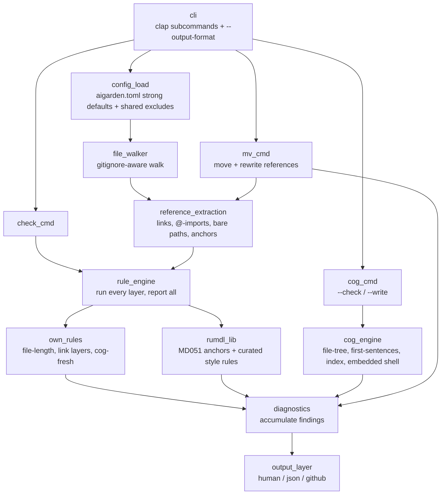

# aigarden design

**One-liner:** a Rust CLI that lints and maintains repositories for AI-agent + human collaboration — link/reference integrity, context-size budgets, and generated-content freshness — extracted from the doc-hygiene gates a large AI-authored codebase grows by hand.

The premise: when agents write most of the code and docs, conventions that a human reviewer used to hold in their head have to be mechanized, because nobody is reading every diff. A gate is better documentation than a sentence. `aigarden` turns each convention into a rule that runs in one pass and reports everything.

## Architecture



The load-bearing shape: **one reference-extraction core**, shared by `check` (which lints references) and `mv` (which rewrites them). In the tool this design is extracted from, those two lived as independently-drifting regex copies kept in sync by hand — the single core removes that class of bug by construction.

## v1 rule catalog

Rules are kebab-case, no numeric codes. Every rule is on by default and individually toggleable — repo-wide via the top-level `ignore` list, or per path via `[per-file-ignores]`.

**Reference integrity** — the six layers of the link gate, run together and all reported:

- `link-target` — a relative markdown link points at a file that exists on disk; extensionless wiki-style links try `.md`. Own-implemented on the shared reference-extraction core (native byte spans for `mv`), not `rumdl_lib` MD057 — MD057 duplicates existence-checking the core already does and gives no span the extractor lacks
- `anchor-resolves` — a `#fragment`, in-file or `other.md#section`, resolves to an actual heading, honoring GitHub anchor-slug rules (via `rumdl_lib` MD051)
- `import-target` — an `@path` import in an always-loaded file (`CLAUDE.md`, `AGENTS.md`, `SKILL.md`) resolves on disk. These fail *silently* at runtime, so nothing else catches a broken one
- `bare-path` — a backticked, file-shaped path in markdown prose (interior slash, real-looking extension) exists relative to the file or repo root; git-ignored candidates are skipped as environment artifacts
- `link-case` — a link target's case matches the committed path exactly. macOS is case-insensitive, so a wrong-cased link passes locally and 404s on case-sensitive CI
- `code-doc-ref` — a doc path (`docs/…`, `issues/…`) cited inside a *non-markdown* source file exists. Root-relative only — nothing establishes a code file's doc directory. Like `bare-path`, a candidate resolving to a git-ignored path is skipped as an environment artifact

**Size budgets:**

- `file-length` — a file stays under its budget. The metric is chosen per file category, because "length" means different things: code files budget **lines** (human readability), while always-loaded guidance files and doc prose budget **chars/tokens** (context cost, ~4 chars/token). Config declares a `"glob" = { lines | tokens = N }` budget map. Line counting is true line count, not a newline count — a file missing its trailing newline is not silently one line short

**Markdown style:**

- `markdown-style` — a curated, auto-fixable slice of `rumdl_lib`'s style rules (trailing spaces, hard tabs, multiple blank lines, a blank line either side of a code fence, single trailing newline), surfaced under aigarden's own config and diagnostics — repos drop `.rumdl.toml`: one tool, one config. `reflow` names the repo's paragraph-wrapping convention and is opt-in: `"wrap"` re-wraps a paragraph that runs past 80 columns, `"never-wrap"` joins every hard-wrapped paragraph to one physical line (so a reworded sentence is a one-line diff) and leaves code fences and tables alone. aigarden owns the MD013 settings each mode means, so a repo picks a convention rather than raw rumdl knobs. `aigarden check --fix` applies the fixes on disk and re-reports the residue, so a second `--fix` run is a clean no-op

**Generated freshness:**

- `cog-fresh` — every generated cog block matches what its generator would produce now (see [Cogs](#cogs))

**Link readability:**

- `descriptive-anchor` — a stable-ID link whose *whole visible text* is a bare ID reads badly when the link is a sentence's subject ("as [ADR-0026] argues" assumes the reader already knows 0026). The rule wants descriptive anchor text; the ID stays in the link target. Fully config-driven and generic: the ID shapes are regexes in `[descriptive-anchor] patterns`, so nothing is project-specific, and with no patterns the rule is **inert** (safe to leave on). A parenthetical citation — `(see [ADR-0026])` — reads as an aside, not a subject, and is never flagged; the whole-text match means `[ADR-0026 — gated publication]` is already descriptive and never flagged

**Frozen-history contract:**

- `status-header` — a tracker doc (an issue or plan) carries its lifecycle state in a `**Status:** <value>` header, not its folder. Every doc matching `[status-header] files` must carry a status whose leading keyword is in `live ∪ terminal`; a missing or unrecognized status is a finding (**fail loud, never a silent skip**). A **terminal** status (e.g. `done`, `implemented`) marks the doc *frozen*: it is kept as as-built history and may legitimately cite now-gone paths, so its citations are exempt from the rules named in `[status-header] suppresses`. The exemption is keyed off *status*, not a path, and each rule declares whether it can honor it (`frozen_aware` on the `Rule` trait): the **citation** rules — `link-target`, `link-case`, `bare-path`, `import-target`, `anchor-resolves`, `descriptive-anchor` — may be named in `suppresses`, and each repo picks how far to go. Rules about a doc's own structure (`file-length`, `cog-fresh`, `markdown-style`, `status-header`) are not suppressible, nor is `code-doc-ref`, which reads only non-markdown files and so never sees a frozen doc; naming one is a loud config error rather than a silent no-op. Suppressing `link-target` is what makes a frozen doc *fully* frozen — its links stop being checked, which in turn frees `aigarden mv` from rewriting them. `inherits-from` widens the unit from a file to a **directory**: name the file that carries the status (`plan.md`), and every scanned doc beside it with no header of its own inherits that status, so a design and its working artifacts freeze together and the artifacts need no header. A doc with its own header keeps it, and a directory lacking the named file is unaffected. Config-driven and **inert** until `files` is set; a repo-wide contract, not per-path overridable. This closes mycelia's single biggest parity gap (see [roadmap.md](roadmap.md))

Other mycelia-specific gates (diagram-tree axis tags, `§N` design-doc refs) are deliberately **not** in v1 — see [roadmap.md](roadmap.md).

### Rule introspection

Each rule carries its own contract — a description, config keys with defaults, an example finding, fix behavior, and a lifecycle status — on the `Rule` trait itself, so there is one source and no separate catalog to keep in sync. Two read-only commands surface it:

- `aigarden rules` — one row per rule: name, status (`report-only`, `fixable`, or `config-gated` for a rule inert until configured, like `descriptive-anchor`), and the one-line description
- `aigarden explain <rule>` — the full contract for one rule. An unknown name is a tool error (exit 2) that lists the known rules

## Config model

`aigarden.toml` at the repo root, ruff-style: strong defaults, an empty file mostly works, every rule toggleable, per-rule tables for options. The walker already honors `.gitignore`; the top-level `exclude`/`extend-exclude` globs add tool-level path exclusions **defined once** and shared by every rule and by `mv` — the walked-file universe, the single home for what used to be a fixtures-exemption reimplemented in three separate tools. `exclude` **replaces** the built-in defaults (`**/fixtures/**`); `extend-exclude` **adds** to the effective base. Both may coexist, and both mirror ruff.

```toml
# aigarden.toml — everything on by default; change only what you need.

extend-exclude = [".claude/worktrees/**"]  # added on top of the built-in **/fixtures/**

# Turn a rule off repo-wide.
ignore = ["cog-fresh"]

# file-length: a "glob" = { lines | tokens = N } map, first matching glob wins.
[file-length.budgets]
"**/*.rs" = { lines = 700 }
"{CLAUDE,AGENTS}.md" = { tokens = 4000 }   # ~4 chars/token

[markdown-style]
reflow = "never-wrap"   # one line per paragraph; also "wrap" or the default "off"

# descriptive-anchor: inert until you declare the stable-ID shapes (regexes).
[descriptive-anchor]
patterns = ["ADR-\\d+", "T\\d+", "P\\d+"]

# status-header: the frozen-history contract; inert until `files` is set.
[status-header]
files = ["issues/**/*.md", "plans/*.md"]  # docs under the contract (README skipped)
live = ["open", "needs-design", "in-progress", "active", "open question"]
terminal = ["done", "wontfix", "implemented", "superseded"]  # frozen ⇒ exempt
suppresses = ["bare-path", "link-case", "descriptive-anchor", "link-target"]  # citation rules only
inherits-from = "plan.md"  # a directory is one item: siblings take plan.md's status
```

Unknown keys are rejected (a typo fails loudly at startup, never a silent no-op), and every budget value must set **exactly one** of `lines`/`tokens`. A budget value is an inline table (`{ lines = N }` or `{ tokens = N }`), so `metric` and `max` fuse into one key. `file-length` budgets resolve in **declaration order, first matching glob wins**: `extend-budgets` entries are checked before the effective base — `budgets` if set, else the built-in defaults — so a user glob shadows a default and extends coverage to new globs without re-listing the base. The built-in defaults live in `config.rs` (generic, no repo-specific globs): guidance files (`{CLAUDE,AGENTS,GEMINI,SKILL}.md`) and markdown budget tokens, source files budget lines; the cap is inclusive (`value > max` is a finding).

### Per-file ignores

`exclude` decides which files are *walked at all*; **`ignore` and `[per-file-ignores]`** decide which rules run on the walked files. There is no separate per-rule `exclude` key — disabling a rule for a glob *is* how you exempt those files from it:

```toml
# Off everywhere.
ignore = ["descriptive-anchor"]

# The docstrings, test fixtures, and snapshots here cite example doc paths on
# purpose. Turn off code-doc-ref for them — every other rule still sees them.
[per-file-ignores]
"tests/**" = ["code-doc-ref"]
"src/references.rs" = ["code-doc-ref"]
"vendor/**" = ["bare-path", "file-length"]  # a matched file gets no length check either
```

`ignore` disables a rule across the whole repo. `[per-file-ignores]` maps a glob to a rule list; for a given file, the **union** of every matching entry's rules is disabled — the semantics are ruff's, **order-free** (two entries that both match a file simply combine, there is no precedence or re-enable). This applies to *every* rule: a file matched for `file-length` gets no length check, and a doc matched for `status-header` is exempt from the header requirement. A [`Resolver`](../src/config.rs) compiles the globs once and answers `is_enabled(rule, path)` in one place, so the rule bodies never re-implement path scoping. Options that remain per-rule (`reflow`, `patterns`, budgets, the status vocabulary) are **global** — read straight from the rule's table, not resolved per path.

## Cogs

A cog is a generated block whose body is recomputed on every run. Markers are HTML comments, so they vanish in rendered markdown:

```
<!-- aigarden:cog file-tree src -->
...generated body, regenerated on every run...
<!-- aigarden:end -->
```

The twist over a plain cog clone: a marker names **either** a built-in generator **or** an arbitrary shell command embedded in the marker itself (`<!-- aigarden:cog sh "…" -->`). Built-ins are a deliberately non-Turing-complete template language; the shell escape hatch covers everything else without teaching the tool a scripting language.

**Marker grammar.** The open marker is an HTML comment `<!-- aigarden:cog <generator> <args> -->`; the close marker is `<!-- aigarden:end -->`. `<generator>` is one built-in name or `sh`. `<args>` is whitespace-separated tokens where a `"…"`-quoted run is one token (so a path with spaces, or a whole shell command, stays intact). The built-ins take a single positional path/glob; `sh` takes exactly one quoted command. Parsing is **fence-aware**: a marker inside a ```` ``` ```` or `~~~` fence is a documented example, not a live block — a doc can show the syntax without expanding it. A nested open marker or an unterminated block fails loudly; it never passes as fresh. Generated output is normalized so a non-empty body ends in exactly one newline (the end marker always lands on its own line).

Built-in trio for v1 (each is a pure, deterministic function of the tree on disk):

- `file-tree <path>` — an indented tree of `<path>`, resolved from the **cog file's directory**. Honors `.gitignore`, skips hidden files and `.git`; directories get a trailing `/`; entries sorted by path (2-space indent per depth). Errors if the path does not exist
- `first-sentences <path>` — the short-glossary projection of a markdown file (resolved from the **cog file's directory**) of `## Section` headers and `- **Term** — gloss` bullets: re-emits each section with every gloss cut to its first sentence. Bullets require the literal ` — ` (U+2014 em dash) separator. First-sentence cutting ignores periods inside backticks/parens/brackets and the abbreviations `e.g.`/`i.e.`
- `index <glob>` — one `- [title](link) — gloss` bullet per file matching `<glob>` **relative to the repo root**, sorted by path. The link is relative to the cog file's directory; `title` is the file's first `# heading` (else its filename stem); `gloss` is a frontmatter `description:`, else the first sentence of the first prose paragraph

`sh "<command>"` runs the command via `sh -c` with **cwd = the file's repo root** (the nearest `.git` ancestor, else the scan root) and splices its stdout. A nonzero exit is a tool error with stderr surfaced — never a silent empty region.

`aigarden cog --check` gates freshness (a stale block is a `cog-fresh` diagnostic, exit 1; never writes); `aigarden cog --write` regenerates in place, printing which files changed. The two are separate code paths on purpose — a check that regenerated-then-compared against itself would always pass. One flag is **required**: there is no default mode.

A failing generator is treated differently by the two entry points. Standalone `aigarden cog --check` (and `--write`) treats it as a **tool error** (exit 2, loud on stderr) — a write must be correct or not happen. The same blocks reached through the `cog-fresh` rule during `aigarden check` treat a failure as an ordinary **finding** (exit 1), so one bad generator can never abort the whole lint run.

## mv

`aigarden mv <src> <dst>` moves a **file** (`git mv` when tracked, else a plain rename that never loses data), then rewrites **every reference form the link rules audit** — markdown links, backticked bare paths, and `@`-imports across markdown, plus root-relative doc-path tokens across non-markdown source. Any `#fragment` on a rewritten link is preserved. The moved file's own outbound relative links are re-anchored from its new directory. It uses the same reference-extraction core and the same exclusions as `check`, then re-runs the reference rules to confirm it left the repo clean (exit 1 with the residue if not — the verify-after step).

**Frozen docs are left alone.** A reference inside a terminal-status doc is skipped when `[status-header] suppresses` names the rule that would report it once stale — nothing checks it, so a rename has no reason to edit as-built history (which a repo freezing its terminal docs may forbid outright). The one exception is the moved file itself: moving it is already an edit to it, so its own outbound links are re-anchored rather than left dangling.

**Staging mirrors the move.** When `<src>` was tracked (the `git mv` path), `mv` also `git add`s each referencing file it rewrote, so the whole move — the rename plus every reference rewrite — lands as one fully-staged changeset, consistent with `git mv`'s own staging. Only the files `mv` itself touched are staged; unrelated worktree edits are never swept in. When the move fell back to a plain rename (untracked src, or no git), nothing is staged.

`mv`'s per-kind resolution must mirror each rule's, or the rewrite and the verify-after disagree. A bare path is the one kind resolved **both** file-relative and repo-root-relative (matching `bare-path`), so a root-relative backtick like `` `docs/x.md` `` in a subdir doc rewrites and re-verifies clean; every other kind keeps its single resolution (code doc-refs root-relative, links/imports file-relative). The extraction grammar is shared by construction; this resolution parity is a per-kind obligation the two sides must uphold together.

**File-only for v1** — a directory source is refused (`mv` of a tree, with recursive re-anchoring, is deferred; not cheap enough to do half-right). It also refuses when `<src>` does not exist or `<dst>` already exists, rather than clobbering. `<dst>` ending in `/`, or naming an existing directory, moves into it under the source's filename.

## Output formats

`--output-format` selects the renderer, defaulting to `human`:

- `human` — annotated source snippets (rustc-style, via `annotate-snippets`); findings without a span render as a compact `path: [rule] message` line
- `json` — structured findings for agents and tooling
- `github` — GitHub Actions workflow-command annotations (`::error file=…,line=…,col=…::[rule] message`)

Across all formats: the **green path is silent** (one pass line), the **red path is loud** (every finding). aigarden owns this UX natively rather than wrapping each check in an output shim.

**Exit codes:** `0` clean, `1` findings, `2` tool/config error (bad config, no files found). A config or IO error is loud on stderr and never masquerades as a clean pass.

The **json schema** is versioned so tooling can pin it:

```json
{
  "version": 1,
  "summary": { "files_scanned": 12, "findings": 1 },
  "diagnostics": [
    {
      "rule": "file-length",
      "path": "src/big.rs",
      "message": "701 lines exceeds the budget of 700 for `**/*.rs`",
      "suggestion": "split the file or raise the budget",
      "span": null
    }
  ]
}
```

`span` is `null` for whole-file findings, else `{ start_line, start_col, end_line, end_col, start_byte, end_byte }` (1-based line/col, byte offsets for autofix). `suggestion` is omitted when absent.

## Bugs fixed by design

Each of these was a known defect or drift risk in the hand-grown tooling this extracts from:

- **Report everything** — every rule runs and every finding surfaces in one pass; no stop-at-first-failing-layer that hides the next class of failure until you re-run
- **One reference-extraction core** — `check` and `mv` share it, so their link grammars cannot drift apart
- **Exclusions defined once** — the fixtures/worktree exemption lives in config, not reimplemented per rule
- **True line count** — `file-length` counts actual lines, not trailing-newline-sensitive `\n` count
- **Per-cog error boundary** — one failing generator reports itself; it does not crash the whole run
